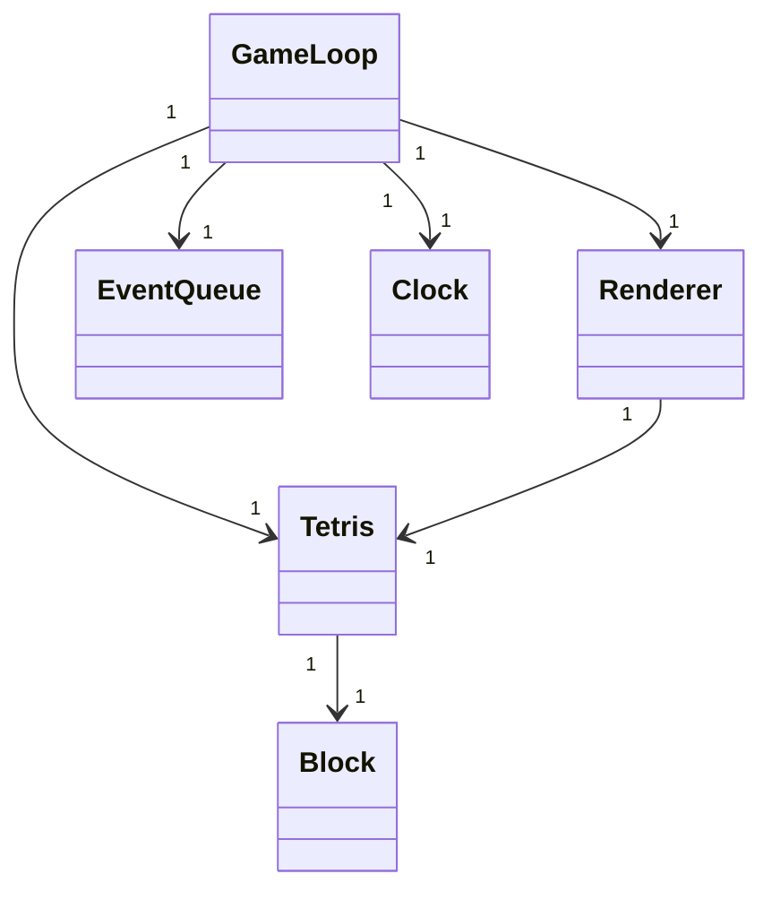
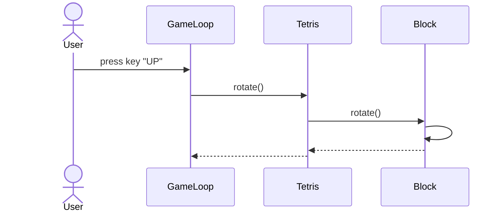

## Luokkakaavio

```mermaid
 classDiagram
    GameLoop "1" --> "1" Tetris
    GameLoop "1" --> "1" Renderer
    GameLoop "1" --> "1" EventQueue
    GameLoop "1" --> "1" Clock
    Renderer "1" --> "1" Tetris
    Tetris "1" --> "1" Block
```

## Sekvenssikaavio palikan kääntämisestä

```mermaid
sequenceDiagram
    actor User
    participant GameLoop
    participant Tetris
    participant Block

    User ->> GameLoop: press key "UP"
    GameLoop ->> Tetris: rotate()
    Tetris ->> Block: rotate()
    Block ->> Block: 
    Block -->> Tetris: 
    Tetris -->> GameLoop: 
```