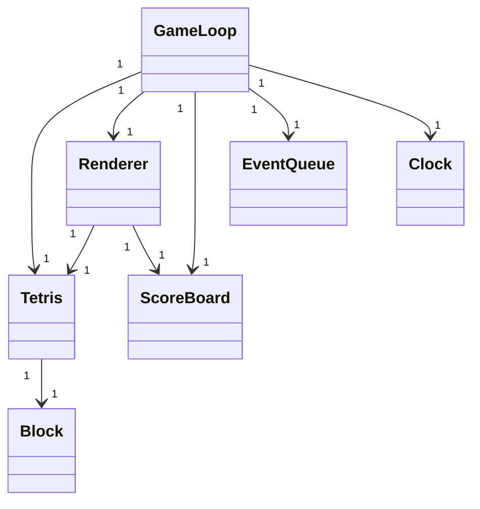
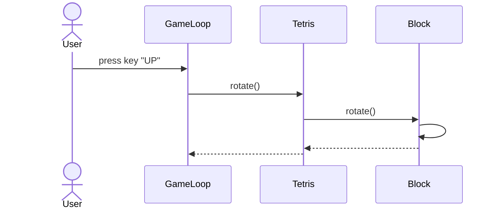

# Arkkitehtuurikuvaus

## Rakenne

Käyttöliittymään liittyvät tiedostot on pakattu ui-hakemistoon. Sovelluslogiikkaan ja tietokantaan liittyvät tiedostot löytyvät src-hakemiston juuresta.

## Käyttöliittymä

Käyttöliittymä koostuu ainakin toistaiseksi yhdestä näkymästä. Näkymän toteutukseen liittyvät tiedostot sijaitsevat ui-hakemistossa.

## Sovelluslogiikka

Sovelluslogiikasta vastaavat pääasiassa luokat Tetris ja Block. Toimintoja ohjaillaan käyttöliittymän kautta.

## Luokkakaavio

## Tietojen pysyväistallennus

Pelin pisteiden tallennuksesta huolehtii luokka ScoreBoard. Pistemäärä ja päivämäärä tallennetaan SQLite-tietokantaan scoreboard. ScoreBoard sisältää myös metodin tietokantahakua varten. Tietokantataulun alustukseen liittyvät koodi löytyy tiedostosta initialize_database.py.

## Päätoiminnallisuudet
### Sekvenssikaavio palikan kääntämisestä

