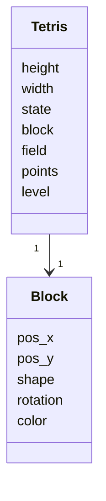
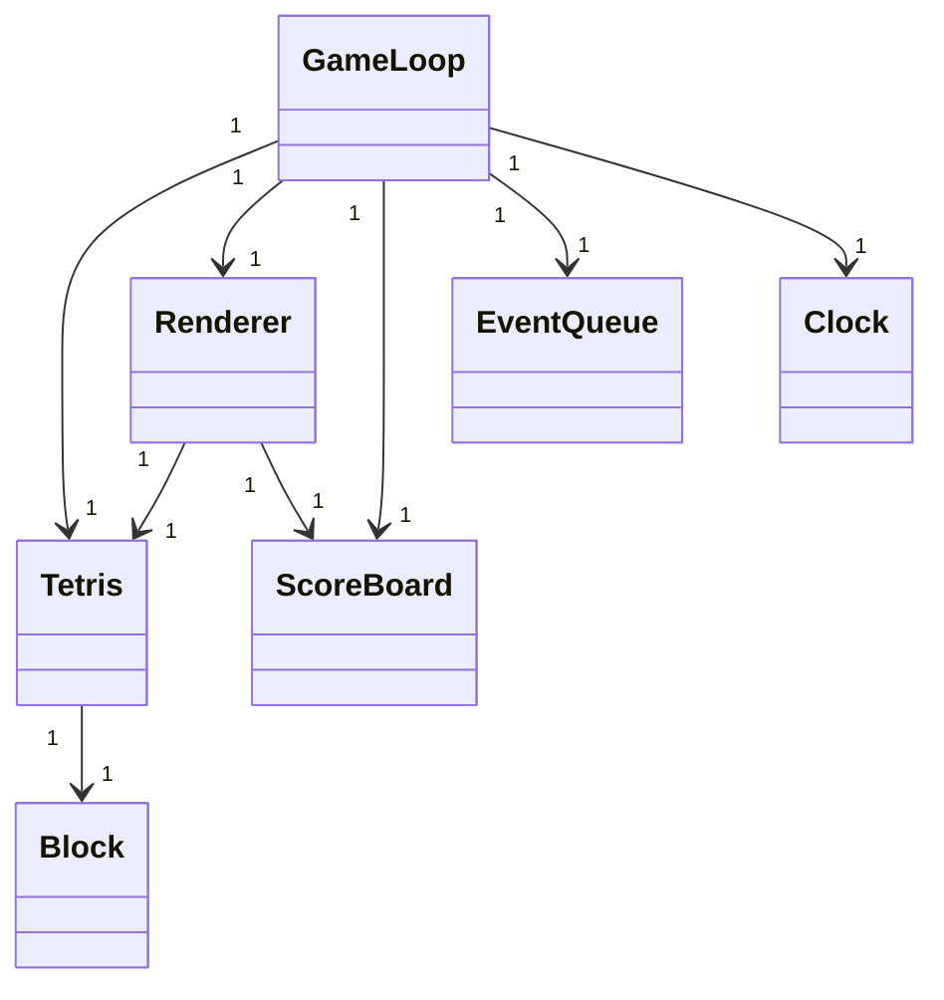
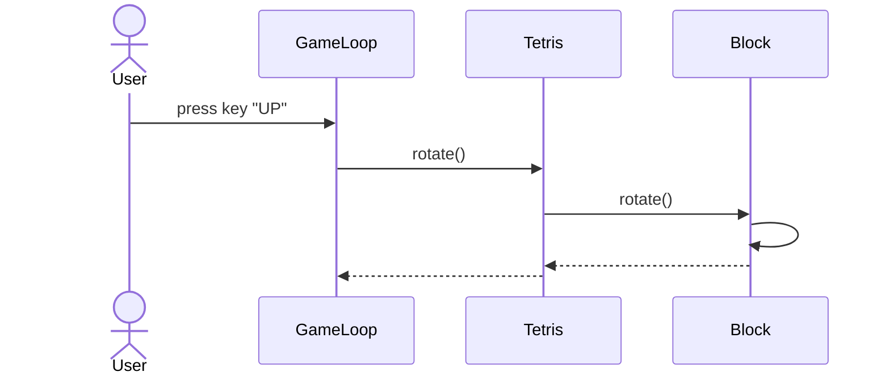
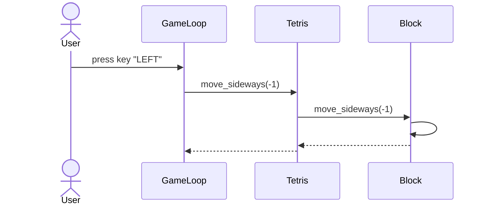

# Arkkitehtuurikuvaus

## Rakenne

Ohjelman pakkausrakenne:

Käyttöliittymään liittyvät tiedostot on pakattu ui-hakemistoon. Sovelluslogiikasta huolehtii services-hakemiston sisältö ja tietokantaan tallentamisesta repositories-hakemiston sisältö. Entities-hakemiston Block-luokka kuvastaa sovelluksen aktiivista muuttujaa ja sisältää myös sovelluslogiikkaa.

## Käyttöliittymä

Käyttöliittymä sisältää pelinäkymän sekä lopetusnäkymän, jossa pelinäkymään tulostuu lista pelin piste-ennätyksistä. Käyttöliittymään liittyvät tiedostot on eristetty [ui](https://github.com/maijams/Tetris/tree/main/src/ui)-hakemistoon, josta ne kutstuvat [services](https://github.com/maijams/Tetris/tree/main/src/services)-hakemiston sovelluslogiikasta vastaavaa luokkaa [Tetris](https://github.com/maijams/Tetris/blob/main/src/services/tetris.py). Kun peli päättyy, ohjelma siirtyy lopetusnäkymään.

## Sovelluslogiikka

Sovelluslogiikasta vastaavat pääasiassa luokat Tetris ja Block. Toimintoja ohjaillaan käyttöliittymän kautta. Block huolehtii putoavan palikan tiedoista ja Tetris pelitilanteesta.

Luokan Tetris metodeja ovat seuraavat:
- `new_block()`
- `move_down()`
- `move_sideways(direction)`
- `rotate()`
- `collision()`
- `freeze()`
- `remove_rows()`
- `update_level()`

Luokan Block metodeja taas seuraavat:
- `rotate()`
- `reverse_rotate()`
- `figure()`
- `move_down()`
- `move_up()`
- `move_sideways(direction)`
- `set_horizontal_position(pos_x)`

## Luokkakaavio

Luokka GameLoop kutsuu muita käyttöliittymästä vastaavia luokkia Clock, EventQueue ja Renderer, sekä sovelluslogiikasta vastaavaa luokkaa Tetris ja tietojen pysyväistallennuksesta vastaavaa luokkaa ScoreBoard. Tetris kutsuu aktiivisesta palikasta vastaavaa luokkaa Block ja pelin renderöinnistä vastaava luokka Renderer kutsuu luokkaa ScoreBoard tulostaessaan lopetusnäkymän high score -listan.

## Tietojen pysyväistallennus

Pelin pisteiden tallennuksesta huolehtii repositories-hakemiston luokka [ScoreBoard](https://github.com/maijams/Tetris/blob/main/src/repositories/scoreboard.py). Päättyneen pelin pistemäärä ja päivämäärä tallennetaan SQLite-tietokantatauluun `scoreboard`, mikäli pistemäärä on enemmän kuin nolla pistettä. ScoreBoard sisältää myös metodin tietokantahakua varten. Tietokantataulun alustukseen liittyvät koodi löytyy tiedostosta initialize_database.py ja tietokantayhteyden muodostamisesta vastaa tiedosto database_connection.py

## Päätoiminnallisuudet
### Putoavan palikan kääntäminen

### Putoavan palikan liikuttaminen sivusuunnassa

