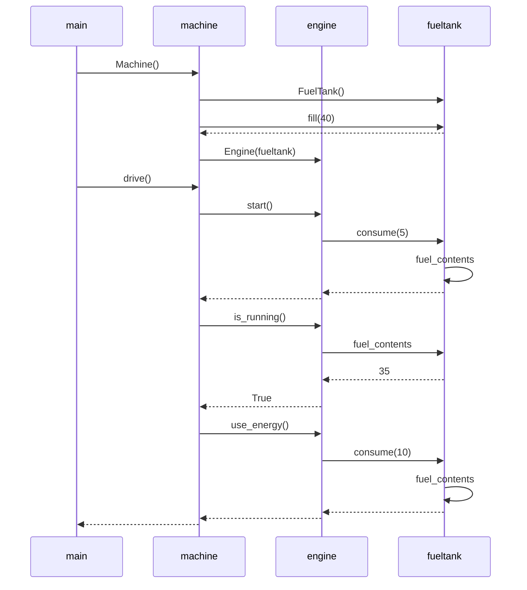

```mermaid
sequenceDiagram
    participant main
    participant machine
    participant engine
    participant fueltank

    main ->> machine: Machine()
    machine ->> fueltank: FuelTank()
    machine ->> fueltank: fill(40)
    fueltank -->> machine: 
    machine ->> engine: Engine(fueltank)

    main ->> machine: drive()
    machine ->> engine: start()
    engine ->> fueltank: consume(5)
    fueltank ->> fueltank: fuel_contents
    fueltank -->> engine: 
    engine -->> machine: 
    machine ->> engine: is_running()
    engine ->> fueltank: fuel_contents
    fueltank -->> engine: 35
    engine -->> machine: True
    machine ->> engine: use_energy()
    engine ->> fueltank: consume(10)
    fueltank ->> fueltank: fuel_contents
    fueltank -->> engine: 
    engine -->> machine: 
    machine -->> main: 

```